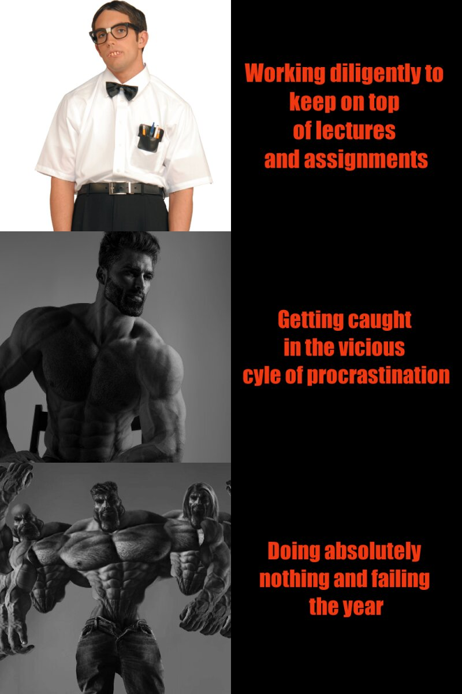

### *Dominic Perkins - Statistics 220 - Assignment 1*
## **Code for my meme**
```
library(magick)

# square one
nerd <- image_read("http://calculatedbravery.files.wordpress.com/2014/01/nerd.jpg") %>%
  image_scale(500)

# square 2
nerd_text <- image_blank(width = 500, height = 500, color = "#000000") %>%
  image_annotate(text = "Working diligently to \nkeep on top \nof lectures \nand assignments" , color = "#F13810" , size = 50, font = "Impact" , gravity = "center")

# square three
gigachad <- image_read("https://pbs.twimg.com/profile_images/1433507587241259016/tp_977hd_400x400.jpg") %>%
  image_scale(500)

# square four - Different font size used to fit in box
chad_text <- image_blank(width = 500, height = 500, color = "#000000") %>%
  image_annotate(text = "Getting caught \nin the vicious \ncyle of procrastination" , color = "#F13810" , size = 48 , font = "Impact" , gravity = "center")

#square five 
omegachad <- image_read("https://i1.sndcdn.com/avatars-xfkhlKFALUQbGh2J-uFQ1sQ-t500x500.jpg") %>%
  image_scale(500)

#square six
Omegachad_text <- image_blank(width = 500, height = 500, color = "#000000") %>%
  image_annotate(text = "Doing absolutely \nnothing and failing \nthe year" , color = "#F13810" , size = 48 , font ="Impact" , gravity = "center")

#Bringing it all together (testing both methods)
nerd_vector <- c(nerd, nerd_text)
top_row <- image_append(nerd_vector)
middle_row <- image_append(c(gigachad, chad_text))
bottom_row <- image_append(c(omegachad, Omegachad_text))

Meme <- c(top_row, middle_row, bottom_row) %>%
  image_append(stack = TRUE) %>%
  image_scale(800)

Meme

image_write(Meme, "Stats_meme_new.png")
```
## **Result**


### Meme information
This meme that I have created is an ironic meme comparing three different styles of learning, all of which become largely apparent during online school. The top panel suggests that people who actively stay on-top of their lectures and assignments are nerds (not me). The middle panel suggests that those who get overwhelmed and end up procrastinating heavily are [gigachads](https://knowyourmeme.com/memes/gigachad) (me) and the bottom panels suggest that those who just give up entirely are on a complete other level. It was heavily inspired by the ["Average Fan vs. Average Enjoyer"](https://knowyourmeme.com/memes/average-fan-vs-average-enjoyer) format. 


# 5 songs I currently have on repeat
1. [Good Days cover - lowkeyluke](https://www.youtube.com/watch?v=klrpmWSN2cU&ab_channel=lowkeyluke)
2. [Follow God - Kanye West](https://www.youtube.com/watch?v=ivCY3Ec4iaU&ab_channel=KanyeWestVEVO) 
3. [Do it again - Cochise](https://www.youtube.com/watch?v=bD_ib9FPBZc&ab_channel=cochise)
4. [Lilac - IU](https://www.youtube.com/watch?v=v7bnOxV4jAc&ab_channel=1theK%28%EC%9B%90%EB%8D%94%EC%BC%80%EC%9D%B4%29)
5. [Lost - Frank Ocean](https://www.youtube.com/watch?v=J3DWAJGaf7o&ab_channel=FrankOcean-Topic)

# 5 Types of dog that I wish to own one day
* [Dachshund](https://www.dogtime.com/assets/uploads/2011/01/file_23020_dachshund-dog-breed.jpg)
* [Doberman Pinscher](https://www.petplace.com/static/d4eb1d31d9e22d830a0097e3e8dcdf3d/98569/AdobeStock_142438416.jpg)
* [Golden Retriever](https://www.prestigeanimalhospital.com/sites/default/files/styles/large/public/golden-retriever-dog-breed-info.jpg?itok=scGfz-nI)
* [Black Labrador](https://dognamesinfo.com/wp-content/uploads/2021/04/Black-Lab-Names.jpg)
* [Australian Shepard](https://www.akc.org/wp-content/uploads/2017/11/Australian-Shepherd.1.jpg)

# **A few extra laughs for ya troubles**
### How it feels when multiple errors come up in your R code


### How it feels when it finally comes together

